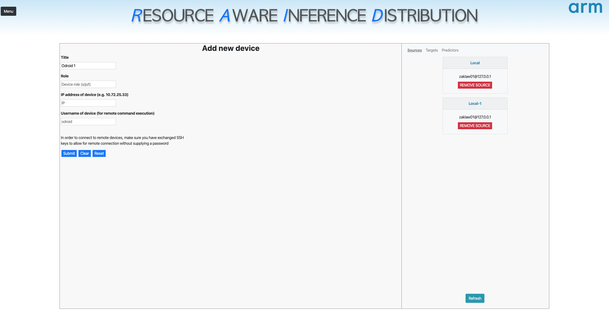
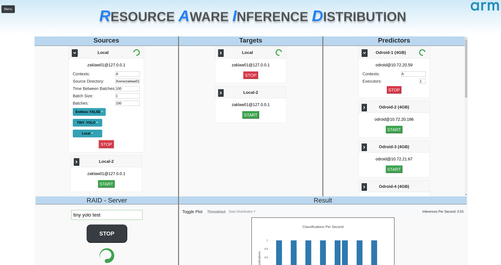

# RAID Web GUI

A user interface for visualizing results and increasing usability of [RAID-Constellation](https://github.com/ZakariasLaws/RAID-constellation).

The website uses webpack for package management, NodeJS with express in the backend and ReactJS in the front end.

The website consists of two pages, **Home** and **Devices**. The Home page is used to run and monitor executions and 
the Devices page is used to manage resources. 

## Setup, Dependencies and Running
Open a terminal window, clone the project and preform the following modifications.

Change the hardcoded `RAID_BIN_DIR` path in `src/utils`. If using an external device, also modify the `DEVICE_BIN_DIR`.

Add the file `database/devices.json` with the content `[]`.

Install dependencies and start the NodeJS server as follows.

```shell script
git clone https://github.com/ZakariasLaws/RAID-Web-
cd RAID-Web-GUI
npm install
nodeamon
```

In a separate window, start watching the source files for changes using webpack:

```shell script
cd RAID-Web-GUI
./node_modules/webpack/bin/webpack.js -w
```

Wait a few seconds for both the server to start and the bundles to be created, then open your browser and navigate to 
`localhoist:3000`.

## Usage
Use the navigation on the left side to toggle Device Management or Home (executing RAID). 

#### Devices Page
When using the website the first time, we must first add 
__RAID agents__ (devices) to our setup. To do this, navigate to the Devices page by clicking the menu button in the 
upper left corner, fill out the form fields to add a new device and submit. We must have at least one Source, 
Predictor and Target, s=Source, p=Predictor and t=Target.

In order for the connection to work, ssh keys **MUST** have been exchanged between
the host running the web GUI and the remote device. In the backend, a ssh connection will be setup to the device and it
will use the ssh keys located in the `~/.ssh` folder. Follow this guide to setup and copy the appropriate key to the 
remote device: [https://www.digitalocean.com/community/tutorials/how-to-set-up-ssh-keys--2](https://www.digitalocean.com/community/tutorials/how-to-set-up-ssh-keys--2)



#### Home Page
First, make sure you understand how RAID works (see [RAID-Constellation](https://github.com/ZakariasLaws/RAID-constellation)).

In order to run an execution, we must first start the server in the bottom left panel. The server will run locally on
the computer. Thereafter, at least one Target should be started to gather the results of predictions. *Only the first 
local Target will have it's results monitored in the bottom right panel*.

When starting a new Source, make sure the Source Directory points to the location of data to submit to the execution. 
Logs from each execution can be found in `/logs/<date>/<name-of-execution>/`. The logs include the output from all
devices as well as the result in a line-by-line JSON format (can be found in the target directory).

The image shows RAID during an execution.


Since the website was main to demo the functionality of RAID, it might still contain some bugs or inconsistencies. 
One problem that some times occur, is that agents do not shut down properly and stay active in the background. If this
happens, navigate to the terminal and find the zombie process using `top` or `ps aux` and kill it.
